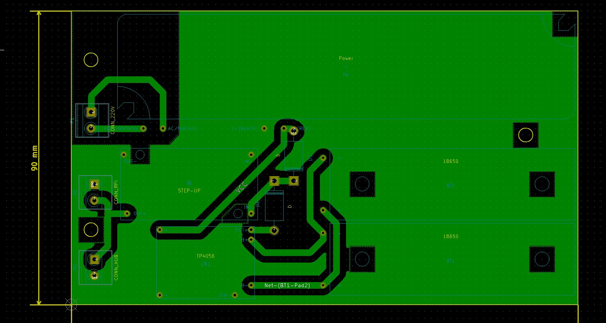

###Udostępniony kod wykorzystujesz na własną odpowiedzialność!

##Realizacja UPS-a do Raptora

Jak wspomniałem w [README](README.md), dzięki uprzejmości Piotra "pimowo" z forum [nettemp.pl](http://nettemp.pl/forum/viewtopic.php?f=8&t=653&hilit=ups) otrzymałem [schemat](/docs/UPS_mini.png) mini UPS-a.
Aby wykonać zadanie posłużyłem się darmowym programem [KiCad](http://kicad-pcb.org/).
Nie miałem nigdy styczności z tego typu programami oraz mam mgliste pojęcie o elektronice, ale udało się - [gotowy projekt](/raptor.ups/).
Dyskusja na [Facebook-u](https://www.facebook.com/groups/malinowepi/permalink/448114628692525/).

Utworzenie schematu sprowadza się do przygotowania symboli dla poszczególnych podzespołów (określenia pinów wejść i wyjść) oraz połączenia wszystkich punktów w całość:

Schemat

Symbol

Trzeba jeszcze wskazać flagi zasilania i wykonać parę dodatkowych operacji np. założyć własną bibliotekę na elementy projektu.
Program KiCad jest spolszczony i dobrze opisany w necie zatem wyszukanie podstawowych zasad pracy z nim nie stanowi problemu.

Aby wykonać płytkę należy opracować (bądź wyszukać w sieci) tzw. footprinty.
Po mojemu są to dokładnie zwymiarowane rzeczywiste podzespoły z rozmieszczonymi na planie takiego footprinta miejscami połączeń (nóżkami) czy otworami montażowymi.

Footprint

Mając powyższe opracowane dla wszystkich elementów schematu można przejść do utworzenia płytki.

PCB

Footprinty można przesuwać, pady (miejsca połączeń z podzespołami) łączyć ścieżkami, wyznaczać strefy do automatycznego wypełnienia połączeniami czy też dodawać strefy chroniące przed takim wypełnieniem.
W efekcie otrzymamy projekt płytki, który można wydrukować laserowo na papierze kredowym:

a następnie żelazkiem (metoda tzw. termotransferu) przenieść na płytkę:

* niedokładności korygowałem permanentnym markerem.

aby po wytrawieniu otrzymać taki efekt:

Prace nad płytką to szereg czynności jak: wiercenie otworów montażowych (elektroniki, wsporników płytki czy mocowania np. koszyków na ogniwa), lutowanie elementów, podłączanie przewodów zasilających, włącznika itp.

Zdaję sobie sprawę, że wiele w tym projekcie brakuje do świetności np. zabezpieczenia na wejściu 220 V, powiększonych średnic niektórych padów do 4 mm itp.
Ale mimo to satysfakcja, że zbudowało się coś co działa i spełnia założone funkcje jest gwarantowana :-)

Zawsze można coś zmienić i nie jest powiedziane, że tak się nie stanie. Z czasem, mam nadzieję że przy współpracy z fanami komputerków Raspberry, uda się projekt doszlifować.

Wykaz podzespołów:

* Obudowa Z-40 183x120x76mm czarna: 10 PLN
* Ogniwa 18650 2 szt.: 50 PLN
* Koszyki na ogniwa 18650 2 szt.: 5 PLN
* Zasilacz GLP GPV-20-5 (5 V 3 A): 30 PLN
* Ładowarka ogniw 18650 np. TP4056 z zabezpieczeniem przed nadmiernym rozładowaniem: 7 PLN
* Przetwornica STEP-UP np. SX1308: 8 PLN
* Diody np. 1N5822 2 szt.: 3 PLN
* Terminal block 2pin 3 szt.: 2 PLN

RAZEM: 115 PLN

___
Maciej Tokarz © My-Poi!